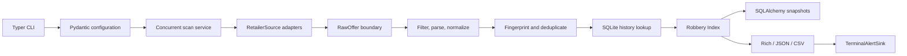

# Caffeine Scout

> **Find energy-drink deals before your wallet gets mugged.**

Caffeine Scout is a location-aware Python CLI that collects energy-drink offers,
normalizes mixed pack sizes to a price per can, remembers price history, and assigns
every offer a mathematically deterministic (and intentionally dramatic) Robbery Index.
It starts with Alani Nu, Ghost, C4, and ZIP code 19103, but brands, locations, filters,
and retailer adapters are configuration—not application assumptions.

## Sample output

```text
Caffeine Scout — ZIP 19103 | sources 2/2 | offers 4 | 2026-07-12 14:30:00 EDT
┏━━━━━━━┳━━━━━━━━━━┳━━━━━━━━━━━━━━━━━━━━━━━━━━━━┳━━━━━━━┳━━━━━━━━━━━┳━━━━━━━━━┓
┃ Score ┃ Brand    ┃ Product / flavor           ┃ Pack  ┃ Effective ┃ Per can ┃
┡━━━━━━━╇━━━━━━━━━━╇━━━━━━━━━━━━━━━━━━━━━━━━━━━━╇━━━━━━━╇━━━━━━━━━━━╇━━━━━━━━━┩
│  89   │ Alani Nu │ Cherry Slush               │ 12×12 │    $16.99 │   $1.42 │
│  75   │ C4       │ Variety Pack               │ 12    │    $24.48 │   $2.04 │
└───────┴──────────┴────────────────────────────┴───────┴───────────┴─────────┘
Deal alerts (1)
  ⚡ Alani Nu Cherry Slush — 1.42/can, score 89
```

The full table also includes retailer, fulfillment, distance or shipping, availability,
and price conditions. Rich automatically degrades cleanly when color is unavailable.

## Architecture



An adapter cannot write final offers directly. It maps permitted retailer data into a
`RawOffer`; shared code applies filters, product parsing, currency math, validation,
deduplication, history, scoring, and persistence. Each adapter runs behind a failure
boundary, so a broken source is reported without discarding healthy results.

## Install

Python 3.12 or newer is required.

With [uv](https://docs.astral.sh/uv/):

```bash
uv sync --extra dev
uv run playwright install chromium
uv run caffeine-scout init-config
uv run caffeine-scout scan
```

With standard pip:

```bash
python -m venv .venv
# Windows: .venv\Scripts\activate
# macOS/Linux: source .venv/bin/activate
python -m pip install -e ".[dev]"
python -m playwright install chromium
caffeine-scout init-config
caffeine-scout scan
```

Playwright's browser is only needed by adapters configured for JavaScript-rendered
public pages. The offline mock source and static JSON-LD parsing do not require it.

## Configuration

`config.example.yaml` is a safe, working configuration. `init-config` copies it to
ignored `config.yaml`:

```bash
caffeine-scout init-config
caffeine-scout init-config --destination my-scout.yaml
caffeine-scout scan --config my-scout.yaml
```

Every command that reads application state accepts `--config`. You may also set
`CAFFEINE_SCOUT_CONFIG`. Put credentials in environment variables or a local `.env`,
never YAML committed to source control; `.env.example` lists supported names.

The SQLite URL defaults to `sqlite:///caffeine_scout.db` and can be overridden with a
top-level `database_url`. Source adapters are individually enabled or disabled.

### Included retailer website samples

The example configuration includes current official links for GNC, The Vitamin Shoppe,
GIANT, ACME, CVS, and Target. They are intentionally disabled or marked discovery-only:

- GNC has exact Ghost, Alani Nu, and C4 product-page examples. Its nearby store is at
  1625 Chestnut Street, Philadelphia, PA 19103.
- The Vitamin Shoppe has an exact Ghost product-page example and a store at 1701
  Chestnut Street, Philadelphia, PA 19103.
- GIANT has an exact Alani Nu delivery-page example plus its energy-drink catalog; its
  official locator lists a store at 60 N 23rd Street, Philadelphia, PA 19103.
- ACME, CVS, and Target are catalog/discovery links only. Dynamic catalog pages are not
  silently treated as product offers. Add a permitted exact product URL before scanning.

Run `caffeine-scout sources` to see every candidate. To try an exact page, change only
that page's `enabled` value to `true`. A live failure remains isolated from other sources.
These entries are configuration examples, not claims that live scraping has been tested
or approved by the retailer.

## Commands

```bash
caffeine-scout scan
caffeine-scout scan --brand "Alani Nu"
caffeine-scout scan --online-only
caffeine-scout scan --pickup-only
caffeine-scout scan --minimum-score 80
caffeine-scout scan --format json
caffeine-scout scan --format csv
caffeine-scout history
caffeine-scout history --brand Ghost
caffeine-scout sources
caffeine-scout init-config
```

Effective price is `listed price + unavoidable shipping - immediate coupon`. Rebates,
store credit, subscriptions, and membership-only discounts are not silently counted.
Their requirements remain visible as conditions.

## Robbery Index

The score is clamped to 0–100: up to 55 points for absolute per-can value, 25 for
savings against a sufficiently sampled historical median, 10 for a genuine advertised
discount, and 10 for convenience plus confirmed availability. Shipping, membership,
subscription, uncertain parsing, low confidence, and stale data can subtract points.
Exact thresholds and label boundaries are covered by tests.

## Data sources and limitations

- **MockSource** is deterministic, realistic, and fully offline. It is the only source
  used by the demo and default data-path tests.
- **JsonLdProductPageSource** reads schema.org `Product`, `Offer`, and `AggregateOffer`
  from an explicit allowlist of exact public URLs. Sites can omit, delay, or publish
  stale structured prices. Missing structured pricing is reported as unsupported.
- **AmazonSource** is deliberately disabled. Amazon's Product Advertising API 5.0 was
  deprecated on May 15, 2026 in favor of the official
  [Creators API](https://affiliate-program.amazon.com/creatorsapi/docs/en-us/introduction).
  The skeleton validates environment-based credentials but does not yet send requests.
  No Amazon integration is claimed as tested.
- Location and stock are only as current and precise as a source makes publicly and
  lawfully available. The application never invents store distance or availability.

## Ethics and retailer terms

Caffeine Scout does not bypass CAPTCHAs, login systems, paywalls, robots restrictions,
rate limits, or anti-bot controls. Use documented APIs whenever available; access only
public pages whose terms permit automated retrieval; identify and pace clients; cache
where appropriate; and disable an adapter when a retailer objects or changes its terms.
The project does not scrape authenticated Amazon pages. Users remain responsible for
retailer terms, applicable law, and credential security.

## Implement a new source

1. Copy `src/caffeine_scout/sources/template.py` into a retailer-specific module.
2. Implement `RetailerSource.search(SearchRequest) -> list[RawOffer]` and a cheap,
   non-invasive `healthcheck`.
3. Keep authentication, request pacing, public API/HTML parsing, and error translation
   isolated in that module. Use HTTPX for async HTTP, Beautiful Soup for static HTML,
   and Playwright only when a permitted page truly requires JavaScript rendering.
4. Add a typed source configuration and register the adapter in `build_sources`.
5. Add saved HTML/JSON fixtures. Tests must never contact a live retailer.
6. Document terms, rate limits, stock semantics, coupons, memberships, and known gaps.

Do not calculate final prices or scores in an adapter. Shared normalization is what
makes retailers comparable.

## Development

```bash
pytest
ruff check .
mypy src
caffeine-scout scan --config config.example.yaml
```

Tests cover parsing, exclusions, Decimal math, deduplication, historical medians,
all label boundaries, malformed data, partial source failure, JSON-LD fixtures, and
machine-readable exports.

## Roadmap

- Implement an approved Amazon Creators API client after account onboarding and a
  stable official SDK/contract are available.
- Add permitted retailer API adapters with store-level inventory for Philadelphia.
- Add Alembic migrations and retention controls as the schema evolves.
- Add optional email, Discord, Slack, and push `AlertSink` implementations.
- Add scheduled scans, historical charts, UPC-aware matching, and richer flavor aliases.
- Add structured adapter telemetry without logging secrets or customer data.
